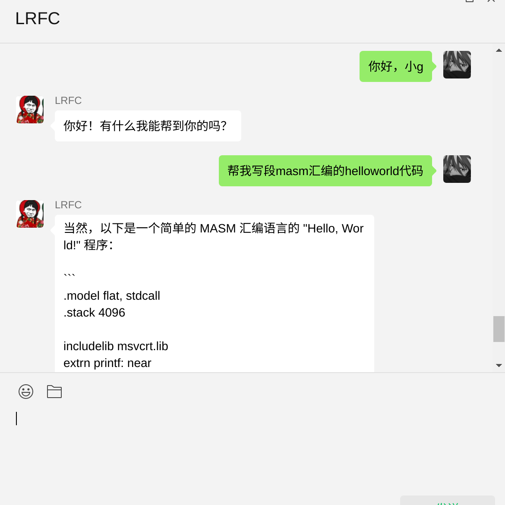

# my_wechat_gpt_bot
### 最近很火的openai,自己看了看官方的gpt3-api,用wechaty写了个微信机器人自用，仅供娱乐,没chatgpt那么智能，但基本能用，期待非官方api的逆向突破!(2023.3.6 已经有成熟的第三方api模块了！)

### Tips: 需要node18及以上


### 2023.3.6
更换gpt3.5模型，启用chatgpt-api方便维护,目前有想法复刻一个gpt的网站，流式传输，不止对话，还有绘画


### 2022.12.24
支持上下语境,无限接近CHATGPT

### Usage：
1.克隆项目

```git clone https://github.com/Zakiaatot/my_wechat_gpt_bot.git ```

2.改一下config

``` 
OPENAI_API_KEY:"XXX", //openai的apikey
BOT_NAME:'@小G',  //机器人昵称
RESET: 'RESET', //重置对话口令
HISTORY: 'HISTORY', //查看历史对话命令
WHITE_LIST: ['Test'] //白名单群组
IS_OPEN_FOR_USER: true //是否向个人用户开启此功能
```

3.安装&启动
``` 
cd my_wechat_gpt_bot
npm i
npm start

扫码登录微信，开始enjoy！
```